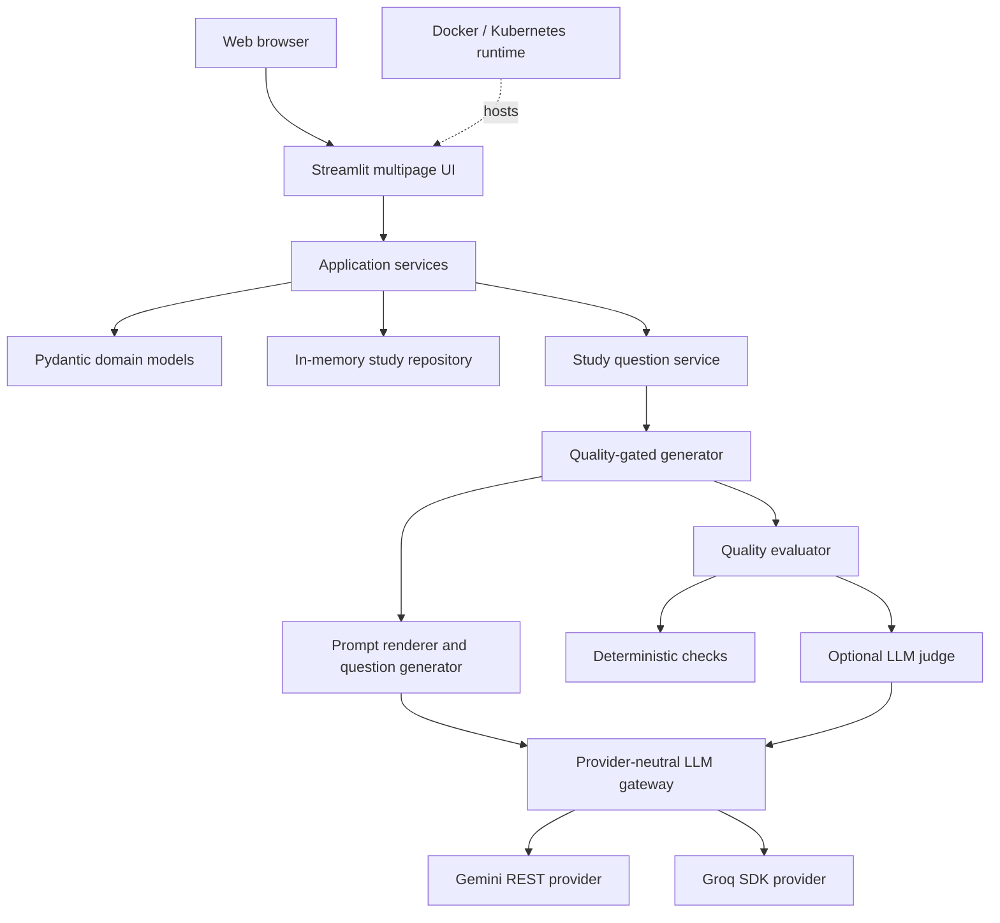
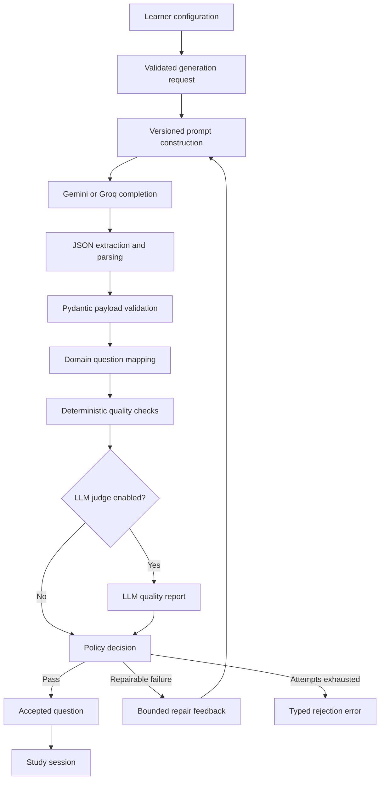
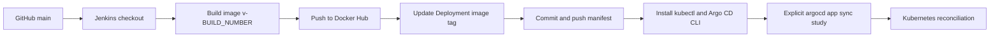

<div align="center">
  <h1>StudyMate</h1>
  <p><strong>AI-assisted practice with strict question schemas, quality gates, and a complete learning loop.</strong></p>
  <p>
    <a href="#quick-start">Quick start</a> ·
    <a href="#system-architecture">Architecture</a> ·
    <a href="#testing">Testing</a> ·
    <a href="#deployment">Deployment</a>
  </p>
  
  <br />
  
  
  
  
  
</div>

> [!NOTE]
> StudyMate currently stores study data in memory for the lifetime of the Streamlit process. It is a functional learning application and deployment reference, but it does not yet provide durable multi-user persistence.

## Project overview

StudyMate turns a topic into a guided practice session instead of returning an unvalidated block of model output. A learner chooses a topic, language, difficulty, and question mode; the application generates one multiple-choice or fill-in-the-blank question at a time, validates it, evaluates its educational quality, and only then adds it to the active session.

The learning loop continues after generation. StudyMate evaluates answers, captures optional confidence, classifies mistakes, schedules review items, and presents session and progress summaries. The current Streamlit experience contains Home, Practice, Review, Mistakes, Progress, and Settings pages.

What distinguishes the project from a basic question generator is its boundary around untrusted LLM output:

- Strict JSON payloads are parsed into discriminated Pydantic models.
- Deterministic checks cover answer validity, distractors, explanations, context alignment, answer leakage, and duplicate risk.
- An optional LLM judge adds a second quality signal.
- Failed quality checks can produce bounded repair feedback and controlled regeneration.
- Provider failures, schema failures, and quality rejection use typed application errors rather than silently accepting malformed questions.

## Key capabilities

| Area | Verified behavior |
| --- | --- |
| Question generation | Multiple-choice, fill-in-the-blank, and deterministic mixed-mode blueprints; easy, medium, and hard difficulty; learner-facing language selection |
| Validation | Strict JSON extraction, forbidden extra fields, exact MCQ option invariants, one fill-blank marker, generated UUIDs, and contiguous question positions |
| Quality evaluation | Deterministic dimension checks, duplicate detection, policy-based decisions, optional LLM-as-a-Judge, and bounded regeneration |
| Practice workflow | Incremental question generation, answer feedback, optional confidence capture, session summaries, and JSON export |
| Learning support | Mistake classification, review scheduling, due-review workflow, progress analytics, and mistake export |
| Hints | A three-level hint contract and UI controls exist; no hint provider is wired into the default application container, so the UI reports hints as unavailable |
| Providers | Gemini is selected when `GEMINI_API_KEY` is present; otherwise Groq is selected when `GROQ_API_KEY` is present |
| Persistence | Repository abstraction with an in-memory implementation scoped to the running Streamlit process |

## System architecture



The application container in `src/application/dependencies.py` is the composition root. It selects one provider gateway, builds immutable generation and judge profiles, and wires the generator, evaluator, regeneration policy, and application-facing question service. Provider transport retries remain separate from educational regeneration attempts.

## Question generation and quality pipeline



Groq settings enable the quality judge by default and allow three generation attempts. Gemini settings prioritize low latency: the judge is disabled by default and generation is limited to two attempts. Both behaviors can be overridden through supported environment variables.

## Repository structure

```text
StudyMate-AI/
├── .streamlit/             # Theme configuration for the Streamlit UI
├── docs/assets/            # Lightweight README-owned visual assets
├── manifests/              # Kubernetes Deployment and Service
├── src/
│   ├── application/        # Use-case services and dependency composition
│   ├── common/             # Typed exceptions and application logging
│   ├── config/             # Pydantic environment settings
│   ├── evaluation/         # Deterministic checks, judge contracts, and policy
│   ├── generator/          # Controlled regeneration and repair prompts
│   ├── llm/                # Provider-neutral gateway plus Gemini/Groq adapters
│   ├── models/             # Question and study-session domain schemas
│   ├── prompts/            # Versioned generation prompts
│   ├── repositories/       # Persistence protocol and in-memory implementation
│   └── ui/                 # Streamlit pages, components, state, and styling
├── tests/                  # Unit, integration-style, architecture, and UI tests
├── Dockerfile              # Python 3.13 non-root application image
├── Jenkinsfile             # Image publishing and explicit Argo CD sync pipeline
├── pyproject.toml          # Package metadata and canonical dependencies
├── streamlit_app.py        # Streamlit entrypoint
└── uv.lock                 # Reproducible uv dependency lock
```

## Technology stack

| Layer | Technologies |
| --- | --- |
| AI and LLM | Gemini REST API, Groq SDK, LangChain prompt templates |
| Domain and validation | Python 3.13, Pydantic v2, pydantic-settings; FastAPI is declared as a dependency but is not the current application entrypoint |
| UI | Streamlit, pandas |
| Quality and reliability | Deterministic evaluators, LLM judge contract, controlled regeneration, typed exceptions |
| Testing | pytest, HTTPX mock transports, Streamlit AppTest |
| Packaging | `pyproject.toml`, uv lockfile, pip-compatible project install |
| Containerization | Docker, Python 3.13 slim, OCI health check, non-root UID/GID 10001 |
| CI/CD and GitOps | Jenkins, Docker Hub, Git, Argo CD CLI |
| Orchestration | Kubernetes Deployment, NodePort Service, probes, rolling updates, resource controls |

## Quick start

### Prerequisites

- Git
- Python 3.13
- A Gemini API key or a Groq API key

The commands below use the project metadata consumed by the Docker build: `python -m pip install .` installs the package and its declared dependencies.

### Linux and macOS

```bash
git clone https://github.com/MustafaKocamann/StudyMate-AI.git
cd StudyMate-AI

python3.13 -m venv .venv
source .venv/bin/activate
python -m pip install --upgrade pip
python -m pip install .

cp .env.example .env
```

### Windows PowerShell

```powershell
git clone https://github.com/MustafaKocamann/StudyMate-AI.git
Set-Location StudyMate-AI

py -3.13 -m venv .venv
.\.venv\Scripts\Activate.ps1
python -m pip install --upgrade pip
python -m pip install .

Copy-Item .env.example .env
```

For a minimal Groq configuration, set this value in `.env`:

```dotenv
GROQ_API_KEY=<YOUR_GROQ_API_KEY>
```

Or use Gemini instead:

```dotenv
GEMINI_API_KEY=<YOUR_GEMINI_API_KEY>
```

Do not commit `.env`. It is ignored by Git and excluded from the Docker build context.

Start the application after activating the virtual environment:

```bash
streamlit run streamlit_app.py
```

Open <http://localhost:8501>. If both provider keys are configured, the current dependency factory selects Gemini for generation and its provider settings determine judge behavior.

## Environment variables

Only one provider API key is required for local execution. Values below are the defaults in `src/config/settings.py`; an empty key is treated as missing.

### Gemini

| Variable | Required | Purpose | Example format / default |
| --- | --- | --- | --- |
| `GEMINI_API_KEY` | One provider key required | Authenticates Gemini requests | `<YOUR_GEMINI_API_KEY>` |
| `GEMINI_BASE_URL` | No | Gemini REST API base | `https://generativelanguage.googleapis.com/v1beta` |
| `GEMINI_GENERATION_MODEL` | No | Generation model | `gemini-2.5-flash` |
| `GEMINI_GENERATION_TEMPERATURE` | No | Generation sampling temperature | `0.35` |
| `GEMINI_GENERATION_MAX_COMPLETION_TOKENS` | No | Maximum generated tokens | `768` |
| `GEMINI_GENERATION_TIMEOUT_SECONDS` | No | Per-request timeout | `20` |
| `GEMINI_GENERATION_REASONING_EFFORT` | No | Optional profile field; unset by default | `none` |
| `GEMINI_GENERATION_MAX_ATTEMPTS` | No | Maximum quality-gated generation attempts | `2` |
| `GEMINI_ENABLE_QUALITY_JUDGE` | No | Enables the LLM quality judge | `false` |
| `GEMINI_JUDGE_MODEL` | No | Judge model; falls back to the generation model | `gemini-2.5-flash` |
| `GEMINI_JUDGE_TEMPERATURE` | No | Judge sampling temperature | `0.0` |
| `GEMINI_JUDGE_MAX_COMPLETION_TOKENS` | No | Maximum judge output tokens | `512` |
| `GEMINI_JUDGE_TIMEOUT_SECONDS` | No | Judge request timeout | `20` |
| `GEMINI_JUDGE_REASONING_EFFORT` | No | Optional judge profile field; unset by default | `none` |
| `GEMINI_SDK_MAX_RETRIES` | No | Bounded transport retries | `1` |
| `GEMINI_RETRY_MAX_DELAY_SECONDS` | No | Maximum delay used for Gemini 429 retries | `2` |
| `GEMINI_THINKING_BUDGET` | No | Gemini thinking token budget | `0` |

### Groq

| Variable | Required | Purpose | Example format / default |
| --- | --- | --- | --- |
| `GROQ_API_KEY` | One provider key required | Authenticates Groq requests | `<YOUR_GROQ_API_KEY>` |
| `GROQ_BASE_URL` | No | Optional Groq-compatible API base URL | `https://api.groq.com` or leave empty |
| `GROQ_GENERATION_MODEL` | No | Generation model | `qwen/qwen3.6-27b` |
| `GROQ_GENERATION_TEMPERATURE` | No | Generation sampling temperature | `0.7` |
| `GROQ_GENERATION_MAX_COMPLETION_TOKENS` | No | Maximum generated tokens | `2048` |
| `GROQ_GENERATION_TIMEOUT_SECONDS` | No | Per-request timeout | `30` |
| `GROQ_GENERATION_REASONING_EFFORT` | No | Provider reasoning profile | `none` |
| `GROQ_GENERATION_MAX_ATTEMPTS` | No | Maximum quality-gated generation attempts | `3` |
| `GROQ_ENABLE_QUALITY_JUDGE` | No | Enables the LLM quality judge | `true` |
| `GROQ_JUDGE_MODEL` | No | Judge model; falls back to generation model | `qwen/qwen3.6-27b` |
| `GROQ_JUDGE_TEMPERATURE` | No | Judge sampling temperature | `0.0` |
| `GROQ_JUDGE_MAX_COMPLETION_TOKENS` | No | Maximum judge output tokens | `2048` |
| `GROQ_JUDGE_TIMEOUT_SECONDS` | No | Judge request timeout | `30` |
| `GROQ_JUDGE_REASONING_EFFORT` | No | Provider reasoning profile for judging | `none` |
| `GROQ_SDK_MAX_RETRIES` | No | Groq SDK transport retries | `2` |

<details>
<summary><strong>Configuration source note</strong></summary>

`.env.example` contains the recommended operational subset. The additional variables in the tables above are still valid because `pydantic-settings` maps every `GeminiSettings` and `GroqSettings` field through the corresponding prefix.

</details>

## Running with Docker

The Dockerfile installs the package from `pyproject.toml`, copies only the application files required at runtime, creates user/group `10001`, exposes port `8501`, and defines a Streamlit health check.

Build the same image repository used by Jenkins:

```bash
docker build -t mustafakocaman/studymate:local .
```

Run with the provider configuration from your uncommitted `.env` file:

```bash
docker run --rm --name studymate -p 8501:8501 --env-file .env mustafakocaman/studymate:local
```

Check the application endpoint from another terminal.

Linux and macOS:

```bash
curl --fail http://localhost:8501/_stcore/health
```

Windows PowerShell:

```powershell
Invoke-WebRequest http://localhost:8501/_stcore/health
```

Docker reports container health separately through the Dockerfile `HEALTHCHECK`:

```bash
docker inspect --format '{{json .State.Health}}' studymate
```

## Deployment

### Kubernetes

The checked-in manifests deploy image `mustafakocaman/studymate:v4` as Kubernetes Deployment `study-buddy` with two replicas. Service `study-buddy` exposes port `80` as a NodePort and forwards traffic to the named container port on `8501`.

The Deployment currently injects only `GROQ_API_KEY`; deploy with Groq unless the manifest is intentionally extended in a separate infrastructure change.

Create the Secret expected by `manifests/deployment.yaml`.

Linux and macOS:

```bash
kubectl create secret generic groq-api-secret \
  --from-literal='GROQ_API_KEY=<YOUR_GROQ_API_KEY>' \
  --dry-run=client -o yaml | kubectl apply -f -
```

Windows PowerShell:

```powershell
kubectl create secret generic groq-api-secret `
  --from-literal="GROQ_API_KEY=<YOUR_GROQ_API_KEY>" `
  --dry-run=client -o yaml | kubectl apply -f -
```

Apply and verify the resources:

```bash
kubectl apply -f manifests/
kubectl rollout status deployment/study-buddy
kubectl get pods -l app.kubernetes.io/name=study-buddy
kubectl get service study-buddy
```

Portable local access through port-forwarding:

```bash
kubectl port-forward service/study-buddy 8501:80
```

Then check `http://localhost:8501/_stcore/health`. For the repository's documented Minikube-oriented NodePort workflow, `minikube service study-buddy --url` returns the assigned URL because the manifest does not pin a `nodePort` value.

Runtime safeguards defined in the Deployment include:

- Rolling updates with `maxUnavailable: 0` and `maxSurge: 1`.
- Startup, readiness, and liveness probes against `/_stcore/health`.
- CPU request/limit of `100m`/`500m` and memory request/limit of `256Mi`/`512Mi`.
- Pod-level `runAsNonRoot` and `RuntimeDefault` seccomp.
- Disabled privilege escalation and all Linux capabilities dropped.

### Jenkins and Argo CD



The Jenkins pipeline does **not** run `kubectl apply`. After publishing `mustafakocaman/studymate:v${BUILD_NUMBER}`, it updates the image line in `manifests/deployment.yaml`, commits that change to `main`, installs the CLIs, obtains Argo CD credentials through the configured Kubernetes access, and explicitly runs `argocd app sync study`.

Jenkins prerequisites reflected by the current file:

| Jenkins item | Current identifier / expectation |
| --- | --- |
| GitHub username/password credential | `github-token` |
| Docker Hub credential | `dockerhub-token` |
| Kubernetes kubeconfig credential | `kubeconfig` |
| Docker-capable agent | Required by `docker.build` and `docker.withRegistry` |
| Shell tooling | `sh`, `sed`, `curl`, Git, permission to install `kubectl` and `argocd` under `/usr/local/bin` |
| Argo CD application | Existing application named `study`; its Application manifest is not stored in this repository |

The Jenkinsfile contains environment-specific Kubernetes and Argo CD endpoints. They are intentionally not repeated here. Parameterize them and move Argo CD authentication to a managed Jenkins credential before reusing the pipeline in another environment.

## Testing

Run the complete suite from an activated virtual environment:

```bash
python -m pytest -q
```

Platform-explicit equivalents are:

```bash
# Linux/macOS
.venv/bin/python -m pytest -q
```

```powershell
# Windows PowerShell
.\.venv\Scripts\python.exe -m pytest -q
```

The current working tree was validated with **255 passed and 1 skipped**. The skipped test is environment-conditional; no coverage percentage is claimed.

The suite covers:

- Strict question schemas, payload mapping, prompts, and JSON handling.
- Deterministic evaluation, judge reconciliation, and regeneration policy.
- Gemini and Groq adapter behavior with mocked provider transports.
- Application services, study sessions, review scheduling, and progress metrics.
- Streamlit entrypoint, semantic user flows, export helpers, and architecture boundaries.

Run a focused module when changing one boundary:

```bash
python -m pytest -q tests/test_evaluation.py
python -m pytest -q tests/test_learning_experience.py
python -m pytest -q tests/test_ui_semantic_flows.py
```

## Security and reliability

| Control | Repository evidence and scope |
| --- | --- |
| Secret handling | `.env` is ignored; `.env*` is excluded from Docker context; API keys use Pydantic `SecretStr`; Kubernetes reads Groq credentials from `groq-api-secret` |
| Container isolation | Image runs as numeric UID/GID `10001`; Kubernetes also enforces non-root execution, seccomp, no privilege escalation, and no Linux capabilities |
| Input boundary | Topic content is marked as untrusted study material in prompts and cannot intentionally redefine the required JSON contract |
| Output validation | Pydantic forbids extra fields and validates cross-field question invariants before questions reach the UI |
| Quality control | Deterministic checks always run; the LLM judge is provider-configurable; regeneration attempts are bounded |
| Availability | Docker health check plus Kubernetes startup, readiness, and liveness probes use Streamlit's health endpoint |
| Resource control | Kubernetes requests and limits bound CPU and memory consumption |
| Error handling | Provider authentication, rate limit, timeout, model, connection, and response-shape failures map to typed exceptions |

These controls reduce risk; they are not a formal security certification. In particular, prompt boundaries are defense in depth rather than a complete prompt-injection guarantee. The in-memory repository provides no durable storage, cross-process consistency, or multi-user isolation.

## Repository limitations and planned work

The following items are **planned opportunities**, not implemented features:

- [ ] Add a durable `StudyRepository` implementation for persistent, multi-user learning history.
- [ ] Wire a concrete hint provider into the default application container.
- [ ] Store an Argo CD Application manifest and parameterize deployment endpoints.
- [ ] Move cluster and Argo CD authentication fully into managed CI credentials.
- [ ] Align Kubernetes provider-secret injection with the local Gemini-or-Groq selection behavior.

## Contributing

1. Fork the repository and create a focused branch from `main`.
2. Install the project with Python 3.13.
3. Make the smallest coherent change and add or update tests.
4. Run `python -m pytest -q`.
5. Commit with a clear message and open a pull request describing behavior and validation.

Do not commit `.env`, provider keys, cluster credentials, local logs, virtual environments, or generated cache files.

## License

No license file is currently present. Until a license is added, the repository should not be assumed to grant open-source reuse rights.

## Author

Repository owner: [MustafaKocamann](https://github.com/MustafaKocamann)

For project discussion, use this repository's GitHub issues and pull requests; no private contact details are published here.
